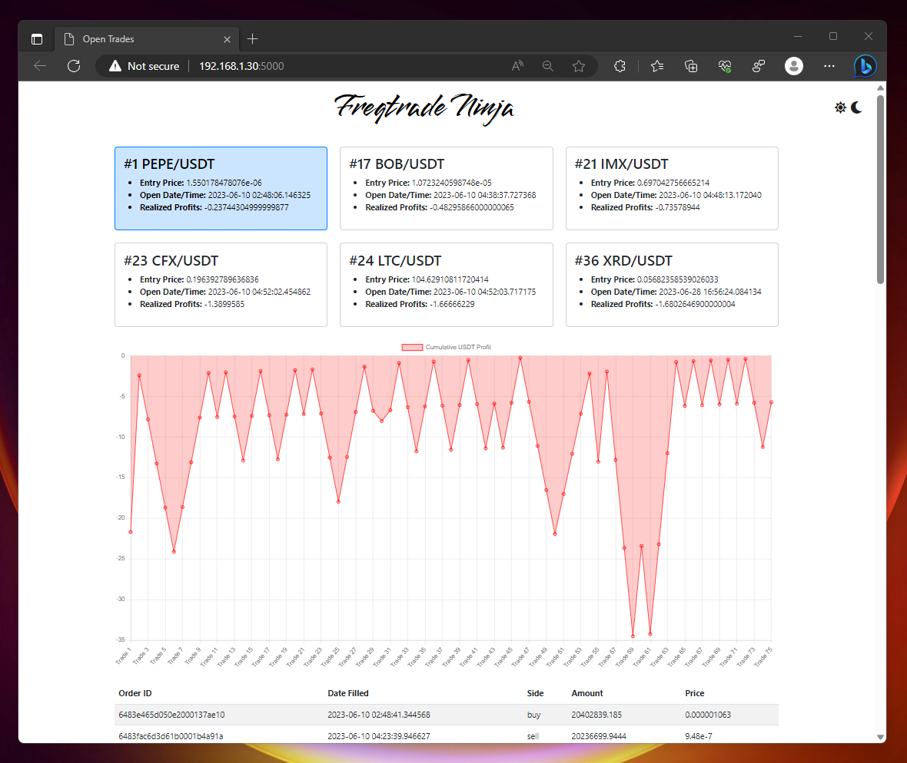

# FreqtradeNinja
Slice through your Freqtrade data and visualize your trades in a different way.  An alternative to frequi, specifically for the NostalgiaForInfinity strategy to visualize grinding trade orders.

## Install Instructions (Developer)
1. Clone the git repo to the server running Freqtrade.
```
git clone https://github.com/nittanygeek/FreqtradeNinja.git
```
2. Setup a virtual environment for python
```
virtualenv venv
source venv/bin/activate
```
3. Install the Python dependencies
```
pip install flask sqlite3
```
4. Set Environment Variables
```
export FLASK_APP=app
export FLASK_ENV=development
```
4. Update config.py to include the path to your database
```
DATABASE = '/path/to/your/freqtrade/user_data/tradesv3.sqlite'
```
5. Run the Flask App
```
flask run --host 0.0.0.0 --debug
```

## Roadmap
- [x] Visualize open, grinding trades on NFIX3
- [ ] Calculate estimated remaining order grinds, based on average order profits and average order frequency
- [ ] Include visuals for the strategy buy/sell signal logic
- [ ] Dockerize the install process
