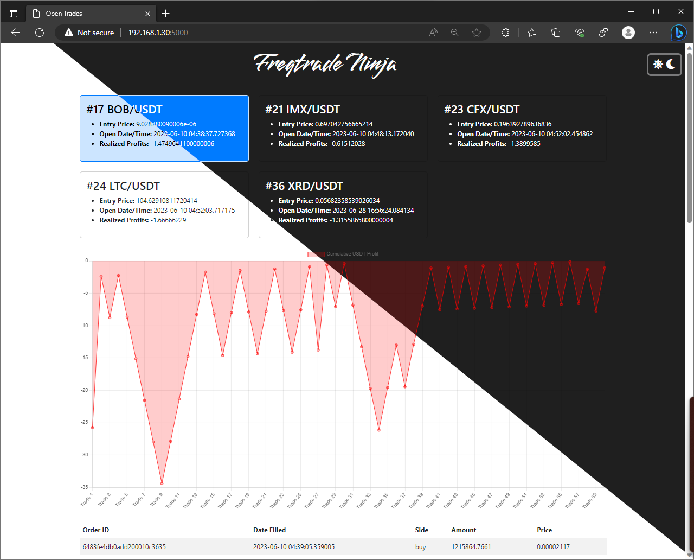

# FreqtradeNinja
Slice through your Freqtrade data and visualize your trades in a different way.  An alternative to frequi, specifically for the NostalgiaForInfinity strategy to visualize grinding trade orders.

> **Warning**
> The code is still very early in development and may contain bugs.  As always, use at your own risk and be sure to report bugs to the Issue tracker as you find them.  Thanks!

## Install Instructions (Docker - Recommended)
1. Clone the git repo to the server running Freqtrade.
```
git clone https://github.com/nittanygeek/FreqtradeNinja.git
```
2. Replace the volume path to your local freqtrade/user_data in the docker-compose.yml file to match your own.  Be sure to leave the ":/freqtrade/user_data" at the end.
```
volumes:
      - /path/to/your/freqtrade/user_data:/freqtrade/user_data
```
3. Start the container with docker compose:
```
sudo docker compose up -d
```

## Install Instructions (Developer)
1. Clone the git repo to the server running Freqtrade.
```
git clone https://github.com/nittanygeek/FreqtradeNinja.git
```
2. Setup a virtual environment for python
```
virtualenv venv
source venv/bin/activate
```
3. Install the Python dependencies
```
pip install flask
```
4. Set Environment Variables
```
export FLASK_APP=app
export FLASK_ENV=development
```
4. Update config.py to include the path to your database
```
DATABASE = '/path/to/your/freqtrade/user_data/tradesv3.sqlite'
```
5. Run the Flask App
```
flask run --host 0.0.0.0 --debug
```

## Support Me!
Like what you see?  Want to see more development?  Buy me a coffee with BTC!


## Roadmap
- [x] Visualize open, grinding trades on NFIX3
- [ ] Calculate estimated remaining order grinds, based on average order profits and average order frequency
- [ ] Include visuals for the strategy buy/sell signal logic
- [ ] Add support for multi-bot configurations
- [x] Dockerize the install process
